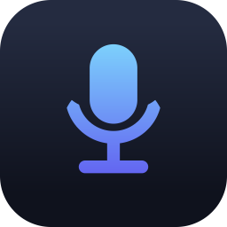

<p align="center">
  
</p>

<h1 align="center">VoiceToClipboard</h1>

> Made for everything — but built with **vibe coders** in mind. 🎙️→📋

> A lightweight, always-on-top Windows widget that turns microphone speech into clipboard text.


> [!NOTE]
> **Project Status:** 🟢 **Working / Functional**  
> *This status must not be changed by AI unless explicitly instructed by the repository owner.*

## Highlights

- Global recording shortcut, customizable in Settings.
- Click-to-record, click again to submit, or press `Esc` to cancel.
- Gemini cloud transcription with automatic 5-model fallback (rate-limited models are remembered and skipped until the next day).
- **Six local offline models** — all multilingual/bilingual with automatic language detection (no language setting, ever):
  - **Tiny · Moonshine v2 Base INT8** (~239 MB) and **Mini · FastConformer Transducer 10 languages** (~102 MB) — tiny footprint, instant low-RAM wake.
  - **Chinese + English (Light) · SenseVoice** (~158 MB, ~400 MB RAM) and **Chinese + English (Big) · FireRedASR2** (~496 MB, ~1.1 GB RAM) — mainly Mandarin, plus English.
  - **Light · Whisper Small INT8** (~610 MB, ~550 MB RAM) — the default pick; 99+ languages, high accuracy.
  - **Big · Whisper Turbo INT8** (~538 MB, ~950 MB RAM) — max precision, distilled 4-layer decoder.
- Audio capture uses the native Web Audio API and `MediaRecorder`; no ffmpeg or sox dependency is required.
- Click-through transparent areas, drag-to-move interaction, system tray controls, visual feedback, silence auto-stop, and idle fade.
- Frameless, restyled Settings window with a custom drag bar and minimize/close controls.
- Auto-Stop includes a live mic meter, a **Reset** button, and a configurable **Auto-Calibrate** that measures room noise then speech (2–5 s per phase) and picks a robust percentile-based threshold.

## Controls

| Action | Shortcut / Control |
| :--- | :--- |
| Start recording | Global shortcut or click the mic |
| Finish and transcribe | Global shortcut or click the mic again |
| Cancel | `Esc` or the stop button |
| Move the widget | Hold the mic and drag |
| Open settings | Hover the top strip / record button and click the gear, or use the tray |
| Quit | Hover the widget and click `X`, or use the tray |

## Install

### Recommended: download the executable

Grab the ready-to-run build from the [Releases page](https://github.com/TruftedBug89/VoiceToClipboard/releases):

- **`VoiceToClipboard.exe`** — unpacked app, no installer needed; just download and run.
- **`VoiceToClipboard-Setup-*.exe`** — NSIS installer that adds a Start-menu shortcut.

No Node.js, no npm, no dependencies. The app is a single signed Windows executable (x64, Windows 10/11).

The API key (only needed for Gemini cloud transcription) can be supplied through the `GEMINI_API_KEY` environment variable or saved through Settings; environment variables take precedence. Keys are never sent to the renderer or printed intentionally.

### Alternative: run from source

For developers or the curious — npm is **not required** to use the app, but if you want to hack on it:

```bash
git clone https://github.com/TruftedBug89/VoiceToClipboard.git
cd VoiceToClipboard
npm install
npm start
```

Requires Node.js 18+ and Windows 10/11.

## Local offline models

Select **Offline Models** in Settings, pick one of the six models from the **Offline Local Models** list, then download the verified model package. The Settings panel shows a model card with the exact download size, RAM estimate, license, and installation state, plus a single **Download & Activate** button with inline progress (no separate modal). Installed models can be removed from the same card. Model data is stored outside the installed application under the canonical Electron user-data directory's `models` folder and is not committed or bundled into releases.

> **Downloads:** `.tar.bz2` model packages are decompressed with `unbzip2-stream` before extraction — the npm `tar` package alone cannot decode bzip2 archives (older builds failed with `invalid base256 encoding`). Extraction keeps only the files the app actually loads (INT8 weights, tokens), skipping the fp32 duplicates bundled in Whisper-style archives. If the GitHub release download fails on your network (TLS resets), every model except `mini-multilingual` automatically falls back to per-file downloads from its HuggingFace mirror.

| Model | Languages (auto) | Download | RAM while loaded |
| :--- | :--- | :--- | :--- |
| Tiny · Moonshine v2 Base INT8 | English, Spanish, Chinese | ~239 MB | ~290 MB |
| Mini · FastConformer Transducer | 10 languages (EN/DE/ES/FR/IT/PL/RU/UK/HR/BE) | ~102 MB | ~270 MB |
| Chinese + English (Light) · SenseVoice | Mandarin, English, Cantonese, Japanese, Korean | ~158 MB | ~400 MB |
| Light · Whisper Small INT8 | 99+ languages | ~610 MB | ~550 MB |
| Big · Whisper Turbo INT8 | 99+ languages | ~538 MB | ~950 MB |
| Chinese + English (Big) · FireRedASR2 | Mandarin + English (code-switching) | ~496 MB | ~1.1 GB |

All six models detect the language automatically — there is no language setting. The RAM figures are conservative worst-case estimates (peak during transcription plus headroom), so a model that measures ~400 MB at rest is listed around ~550 MB. Model packages carry their own licenses; review the source and license information before redistributing them.

Every model above was downloaded through the real install pipeline and verified live on Windows x64 (English/Spanish samples; Mandarin samples for the Chinese+English pair) — all six transcribe correctly.

Gemini remains the recommended cloud option when a local model is unavailable or when broader language coverage is needed.

## Building from source

Build an unpacked app:

```bash
npm run pack
```

Build the Windows installer:

```bash
npm run build
```

Both commands write to the single canonical `dist/` directory as configured in `package.json`. Use `npm run clean:dist` to remove only that generated output. Generated installers, blockmaps, model archives, logs, and unpacked build output belong in GitHub Releases or local ignored directories, not in Git.

Regenerate the icon with:

```bash
npm run icon
```

## Development checks

```bash
npm test
npm run check
npm run check:i18n
npm audit --omit=dev
```

The tests cover model-key selection, legacy config migration, PCM/WAV validation, registry integrity, model-cache path safety, and secret redaction. Full model validation additionally requires Windows x64 and downloading the relevant model archives.

The local inference layer uses a common main-process service and normalized IPC contract. Every backend (Moonshine, NeMo transducer, SenseVoice, Whisper, FireRedASR CTC) has its own adapter branch because their model formats and decoder APIs differ.

## License

The application source is distributed under the MIT License. See [`LICENSE`](LICENSE). Model licenses remain those of their respective publishers.